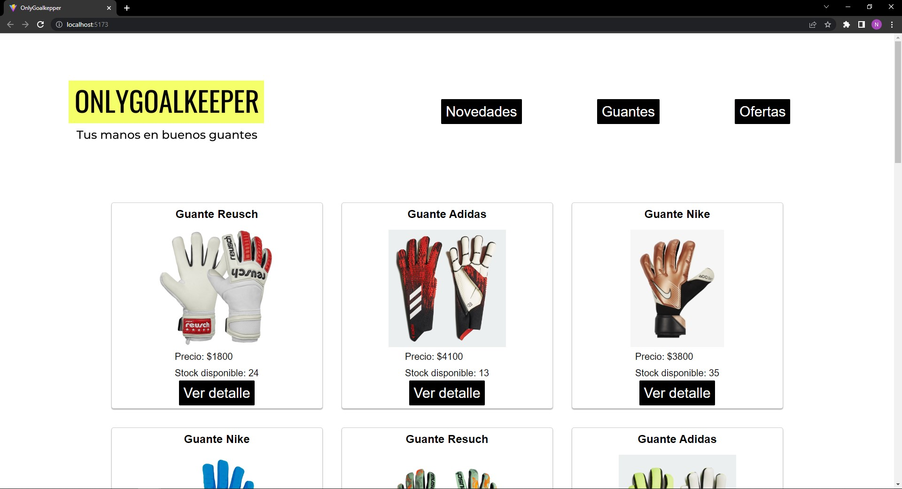
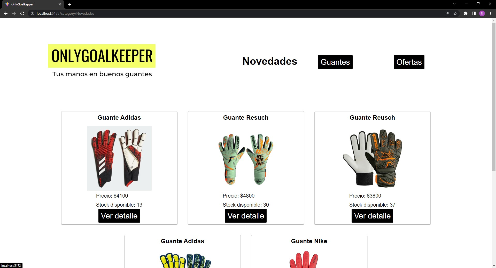
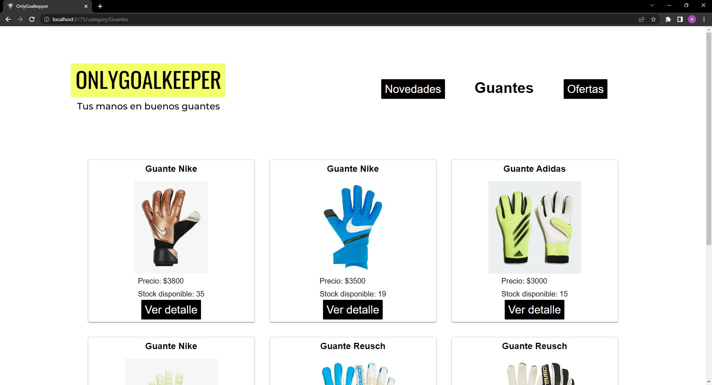
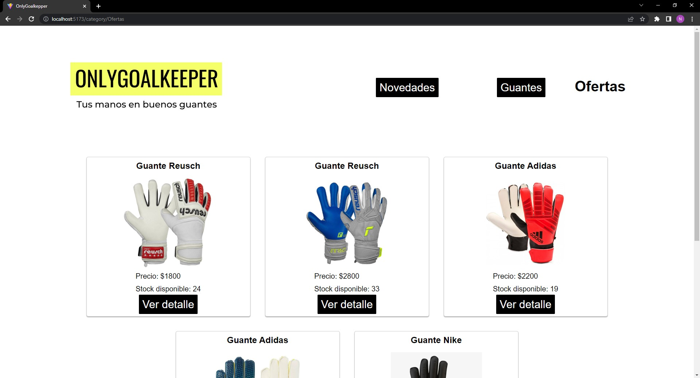

# Proyecto E-commerce OnlyGoalkeeper🚀

Bievenidos a mi proyecto final de React JS!👋

## Acerca del proyecto📄

OnlyGoalkeeper es el resultado del proyecto final del curso React Js de CoderHouse, se trata de un E-commerce de guantes de goleros, con diferentes secciones como lo son Novedades, Guantes y Ofertas y en la página inicial todos los productos disponibles con su respectivo precio, stock y la posibilidad de realizar la compra, finalizando obteniendo la orden de nuestra compra.


## Screenshots







## Tecnologías utilizadas🛠️

▪️ ***HTML*** 

▪️ ***CSS*** 

▪️ ***JavaScript*** 

▪️ ***NPM*** 

▪️ ***ReactJs*** 

▪️ ***NodeJs*** 

▪️ ***Vite*** 

▪️ ***Firebase*** 

▪️ ***Bootstrap*** 

▪️ ***GIT*** 

▪️ ***Visual Studio Code*** 

## Proceso de descarga

Para descargar el proyecto en tu dispositivo podés seguir los siguientes pasos desde tu consola:

1) Clonar el repositorio
```bash
git clone https://github.com/NicolasDiaz98/PF-Diaz-ReactJS.git
```

2) Ir al directorio del proyecto
```bash
cd PF-Diaz-ReactJS
```

3) Instalar las dependencias
```bash
npm i
```

4) Iniciar servidor local
```bash
npm start
```